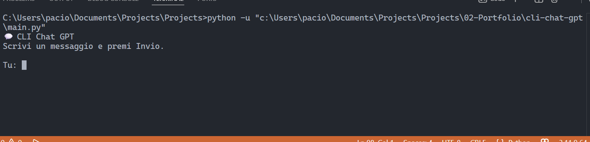
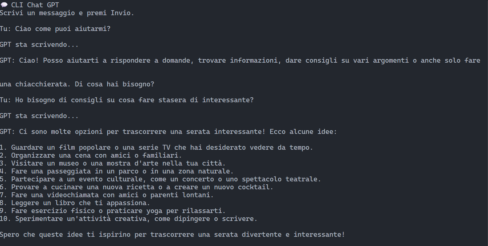

# 💬 CLI Chat GPT

> Terminal chatbot powered by OpenAI GPT-3.5-turbo with **conversation persistence**, **multi-chat management**, and **intuitive command system**.


---

## ✨ Features

**Professional CLI chatbot** with full conversation management and OOP architecture.

✅ **AI-powered conversations**
  - Real-time chat with GPT-3.5-turbo
  - Full conversation history maintained
  - Customizable system message

✅ **Conversation persistence**
  - Save chats with `/save [name]` (timestamp + custom name)
  - Load any previous conversation with `/load`
  - List all saved chats with `/list`
  - JSON-based storage

✅ **Intuitive CLI**
  - Simple command system
  - Built-in help with `/help`
  - Clean terminal interface

✅ **Robust architecture**
  - OOP design with `ChatManager` class
  - Type hints and docstrings
  - Graceful error handling with rollback

---

## 🎬 Demo


*Schermata di avvio dell'applicazione*


*Esempio di conversazione con GPT-3.5-turbo*

---

## 🚀 Installation

### Prerequisites

- **Python 3.10 or higher** ([Download Python](https://www.python.org/downloads/))
- **OpenAI API key** ([Get one here](https://platform.openai.com/api-keys))
- **OpenAI credits** (minimum $5 recommended for testing)

### Quick Start

**1. Clone repository:**
```bash
git clone https://github.com/paciollastefano01-beep/cli-chat-gpt.git
cd cli-chat-gpt
```

**2. Create virtual environment:**
```bash
# Windows
python -m venv venv
venv\Scripts\activate

# macOS/Linux
python3 -m venv venv
source venv/bin/activate
```

**3. Install dependencies:**
```bash
pip install -r requirements.txt
```

**4. Setup API key:**

Create a `.env` file in project root:
```env
OPENAI_API_KEY=your-api-key-here
```

⚠️ Get your API key: [platform.openai.com/api-keys](https://platform.openai.com/api-keys)

**5. Run:**
```bash
python main.py
```

### Verify Installation

If successful, you'll see:
```
💬 CLI Chat GPT
Scrivi un messaggio e premi Invio.
Usa i comandi /new, /list, /save, /load, /exit

Tu:
```

---

## 💡 Usage

### Basic Chat

Simply type your message and press Enter:
```
Tu: What's the capital of Italy?

GPT: The capital of Italy is Rome.

Tu: Tell me more about it

GPT: Rome is one of the oldest cities...
```

### Available Commands

| Command | Description | Example |
|---------|-------------|---------|
| Text | Send message to GPT | `What's the weather?` |
| `/new` | Start new conversation | `/new` |
| `/save [name]` | Save current conversation | `/save brainstorming` |
| `/load` | Load saved conversation | `/load` → select from list |
| `/list` | Show all saved conversations | `/list` |
| `/help` or `/h` | Show available commands | `/help` |
| `/exit` or `/quit` | Exit application | `/exit` |

### Example Workflow

**1. Have a conversation:**
```
Tu: Help me write a professional email

GPT: I'd be happy to help! What's the email about?

Tu: Requesting a meeting with a potential client

GPT: Here's a professional template:

Subject: Meeting Request - [Your Company]

Dear [Client Name],

I hope this email finds you well. I'm reaching out to discuss...
```

**2. Save it:**
```
Tu: /save email-template
💾 Conversazione salvata in: conversations/2025-01-21T14-30-00_email-template.json
```

**3. Load it later:**
```
Tu: /load

📂 Conversazioni disponibili:
1. 2025-01-21T14-30-00_email-template.json | messaggi: 8 | salvata il: 2025-01-21T14:30:00

Seleziona il numero: 1
✅ Conversazione caricata. Messaggi: 8
```

**4. Continue the conversation:**
```
Tu: Can you make it more formal?

GPT: Certainly! Here's a more formal version...
```

---

## 🛠️ Tech Stack

- **Python 3.10+** - Programming language with type hints
- **OpenAI API** - GPT-3.5-turbo for AI conversations
- **python-dotenv** - Secure environment variable management
- **JSON** - Local conversation storage

---

## 📁 Project Structure

```
cli-chat-gpt/
├── chat_manager.py       # ChatManager class (core logic)
├── main.py               # Entry point (8 lines)
├── .env                  # API key (not in git)
├── .env.example          # Template for .env
├── requirements.txt      # Dependencies
├── .gitignore           # Git ignore rules
├── LICENSE              # MIT License
├── README.md            # This file
├── screenshots/          # Demo screenshots
│   ├── 01-avvio.png
│   └── 02-conversazione.png
└── conversations/        # Saved conversations (JSON, gitignored)
```

### Architecture

**OOP design** with `ChatManager` class encapsulating:
- OpenAI client management
- Conversation state (messages array)
- Persistence layer (save/load to JSON)
- Command parser (CLI routing)

**Entry point** (`main.py`):
```python
from chat_manager import ChatManager

if __name__ == "__main__":
    chat = ChatManager()
    chat.run()
```

---

## 💰 API Costs

### GPT-3.5-turbo Pricing

| Type | Cost |
|------|------|
| **Input** | $0.50 per 1M tokens |
| **Output** | $1.50 per 1M tokens |

### Practical Estimates

- **Typical conversation (10 messages):** ~$0.002 (0.2 cents)
- **100 conversations:** ~$0.20
- **$5 credit:** ~2,500 conversations

💡 **Tip:** Monitor your costs at [platform.openai.com/usage](https://platform.openai.com/usage)

---

## 🔒 Security

### ⚠️ Important Rules

1. **NEVER commit `.env` file to GitHub!**
2. **NEVER share your API key publicly**
3. **Regenerate key immediately if exposed**

### Protected by `.gitignore`

```
.env
__pycache__/
*.pyc
venv/
conversations/
```

### If You Exposed Your Key

1. Go to [platform.openai.com/api-keys](https://platform.openai.com/api-keys)
2. Delete the compromised key
3. Create a new key
4. Update your `.env` file

---

## 🐛 Troubleshooting

### Error: "OPENAI_API_KEY not found"

**Solution:**
```bash
# Create .env file with your API key
echo "OPENAI_API_KEY=your-key-here" > .env
```

### Error: "ModuleNotFoundError: No module named 'openai'"

**Solution:**
```bash
# Reinstall dependencies
pip install -r requirements.txt
```

### Error: "Rate limit exceeded"

**Solution:**
- You exceeded the requests/minute limit
- Wait 60 seconds
- Try again

### Error: "Insufficient credits"

**Solution:**
- Your OpenAI credits are depleted
- Add credit at [platform.openai.com/billing](https://platform.openai.com/billing)

---

## 📚 What I Learned

This project was built as a portfolio piece demonstrating:

**Technical skills:**
- **Python OOP:** Refactored 290-line procedural code to clean class-based architecture
- **API integration:** OpenAI Chat Completions with error handling and rollback
- **State management:** Conversation history and JSON persistence
- **CLI design:** Intuitive command system and user feedback

**Key challenges solved:**
- **OOP refactoring** - Migrated from procedural to object-oriented (zero global variables)
- **Conversation persistence** - Designed JSON schema for save/load with metadata
- **Error resilience** - Implemented graceful API failure handling with message rollback
- **UX polish** - Created clear commands and helpful user feedback

---

## 🗺️ Roadmap

Future enhancements:

- [ ] Export conversations to Markdown/PDF
- [ ] Token usage and cost tracking
- [ ] Support for GPT-4 and other models
- [ ] Conversation search functionality
- [ ] Streaming responses (real-time output)

---

## 🤝 Contributing

Contributions welcome! If you want to improve the project:

1. **Fork** the repository
2. Create a **feature branch** (`git checkout -b feature/amazing-feature`)
3. **Commit** your changes (`git commit -m 'Add amazing feature'`)
4. **Push** to the branch (`git push origin feature/amazing-feature`)
5. Open a **Pull Request**

---

## 👤 Author

**Stefano Paciolla**

- 📧 Email: [paciollastefano01@gmail.com](mailto:paciollastefano01@gmail.com)
- 🔗 LinkedIn: [linkedin.com/in/stefano-paciolla-561519209](https://www.linkedin.com/in/stefano-paciolla-561519209/)
- 🐙 GitHub: [@paciollastefano01-beep](https://github.com/paciollastefano01-beep)

💼 **AI Automation Specialist**
🎯 Portfolio Project #1

---

## 📄 License

This project is licensed under the **MIT License**.

You can:
- ✅ Use commercially
- ✅ Modify
- ✅ Distribute
- ✅ Private use

See [LICENSE](LICENSE) file for full details.

---

## 🙏 Acknowledgments

- [OpenAI](https://openai.com/) for GPT-3.5-turbo API
- [Python Software Foundation](https://www.python.org/) for Python
- Open-source community for libraries used

---

## ⭐ Support

If this project helped you:

- ⭐ **Star** the repository
- 🐛 **Report** bugs or issues
- 💡 **Suggest** new features
- 📢 **Share** with other developers

---

## 📚 Useful Resources

- [OpenAI API Documentation](https://platform.openai.com/docs)
- [Python Dotenv Guide](https://pypi.org/project/python-dotenv/)
- [API Keys Best Practices](https://platform.openai.com/docs/guides/production-best-practices)

---

**Built with ❤️ and Python**
